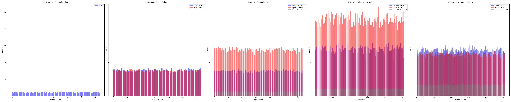
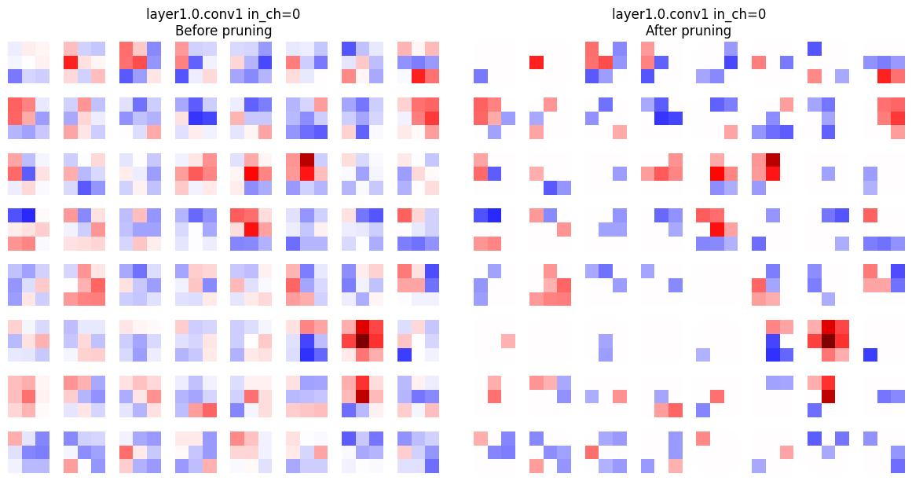
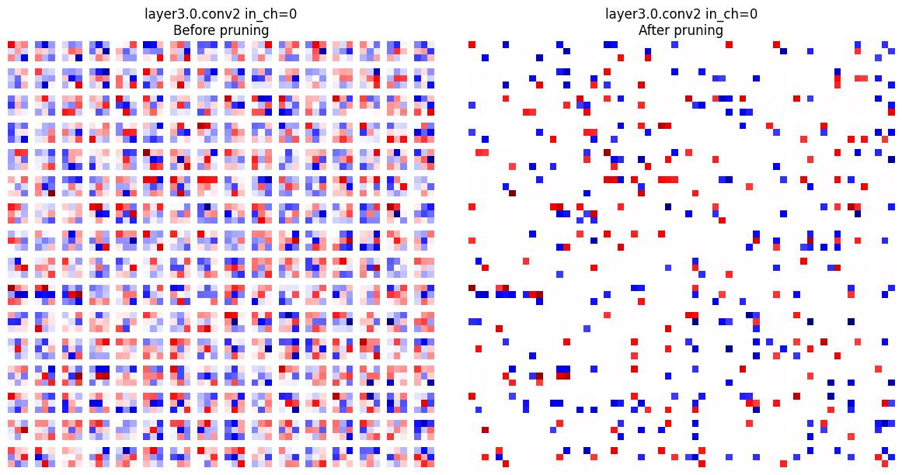

# Pruning Convolutional Neural Networks

_Gilbert François Duivesteijn_

## About

This repository explores how to prune trained networks. For this purpose a very small ResNet10 has been chosen, trained with FashionMNIST.

## Unstructured Pruning (Most Common by Default)

In unstructured pruning, the pruning mechanism operates at the level of individual weight elements within a tensor. For example, PyTorch's default pruning methods such as `prune.global_unstructured` or `prune.l1_unstructured` will set some individual weights to zero, regardless of their location in the weight tensor.

For a convolutional layer (`Conv2d`), whose weights have the shape `(out_channels, in_channels, kernel_height, kernel_width)`, unstructured pruning will zero out selected elements distributed throughout this tensor.

The result of unstructured pruning is that some weights within each output channel (filter) become zero, but it is rare for all weights in a channel to be pruned to zero unless the pruning amount is very aggressive. Most output channels will still have some nonzero weights remaining.

This explains why, in L1-norm per channel plots made after unstructured pruning, the bars representing each output channel's L1-norm are almost always above zero. The L1-norm for a channel is the sum of the absolute values of all its weights; as long as at least one weight remains nonzero, the L1-norm will be positive. Therefore, unstructured pruning does not remove whole channels or filters, but only zeros out some weights within each filter.

## Structured Pruning (Filter/Channel Pruning)

Structured pruning takes a different approach: it can remove entire filters or channels from a layer. For instance, using `prune.ln_structured` with `dim=0` in PyTorch will zero out all weights associated with a specific output channel (filter) in a convolutional layer.

After structured pruning, if you visualize the L1-norm per channel, you may observe some bars dropping exactly to zero. This indicates that the corresponding filter has been entirely zeroed out—effectively, it has been pruned away.

Structured pruning is generally more hardware-efficient than unstructured pruning. Because whole filters or neurons are removed, it is possible to re-architect the model to physically eliminate these pruned components, which can lead to real reductions in memory and computation during inference.

## Experimental results of unstructured pruning

In this experiment, we began by training a custom ResNet-10 architecture on the Fashion-MNIST dataset, allowing the model to learn useful features for classifying grayscale clothing images. After achieving a well-performing baseline, we applied unstructured pruning to the trained network to induce sparsity in the model’s weights. To analyze the effect of pruning, we first visualized the L1-norms of the weights for each layer, which provided insight into the importance and sparsity of individual channels. We also generated activation plots to observe how the responses of different layers changed due to pruning. Furthermore, for a more detailed understanding, we visualized all filters corresponding to input channel 0 for each convolutional layer, both before and after pruning, allowing us to directly observe which parts of the model had significant weights set to zero. After this analysis, we retrained (fine-tuned) the pruned model and compared its test accuracy to that of the original unpruned model, evaluating how well the pruned network could recover its performance.

| ResNet10 | full network | unstructured pruned |structured pruned |
| ------------------------ | --------- | ---------------------------- |---------------------------- |
| batch size               | 64        | 64                           |64                           |
| epochs                   | 15        | 5                            |15                           |
| learning rate            | 1.0e-3    | 10e-4                        |10e-4                        |
| accuracy                 | 0.9265    | 0.9291                       |0.9106                       |
| prune ratio              | n/a       | 0.9                          |0.5                          |
| params                   | 4,904,650 | 4,904,650                    |2,459,338                    |
| Total mult-adds (Mbytes) | 15.25     | 15.25                        |7.94                         |

*Table 1: Before and after pruning of trained ResNet10.* 

   
  <em>Figure 1: Prune ratio against accuracy for structrured pruned networks</em>

|               |
| ------------------------------------------------------- |
|             |
|  |

*Figure 2: L1 Norm per channel per layer for Resnet10 after training (first row), unstructured pruning (second row) and structured pruning (third row).*

|  |  |
| ---------------------------------------- | ---------------------------------------- |
|  |  |
|  |  |
|  |  |

*Figure 3: Weight values (filters) of layer 1, 2, 3 and 4, channel 0 before and after unstructured pruning for Resnet10. Note that in layer 4, more than 90% has been pruned. These layers can be considered for removal.*

|  |  |
| ------------------------------------------- | ------------------------------------------- |
|  |  |
|  |  |
|  |  |

*Figure 4: Weight values (filters) of layer 1, 2, 3 and 4, channel 0 before and after structured pruning for Resnet10. In contrast to the unstructured pruning, some filters are removed, the remaining filters stay unchanged.*

## The Relationship Between Unstructured and Structured Pruning

An important consideration in neural network pruning strategies is whether unstructured pruning—where individual weights are set to zero without regard to the network’s architectural structure—can serve as a beneficial preliminary step before applying structured pruning, which removes entire filters, channels, or neurons. While this sequential approach might seem intuitively promising, empirical evidence and theoretical understanding indicate that performing unstructured pruning before structured pruning generally does not enhance the effectiveness or efficiency of structured pruning, and may in some cases be counterproductive.

The rationale for this lies in the nature of the two techniques. Unstructured pruning produces sparse weight matrices by targeting the least important individual weights, but it rarely results in entire filters or channels being rendered inactive. As a consequence, subsequent structured pruning finds few, if any, additional filters or channels that are composed entirely of zero weights, except in cases where unstructured pruning is applied extremely aggressively—an approach that often severely degrades model accuracy.

Structured pruning, by contrast, assesses the collective importance of whole groups of parameters, such as all the weights in a filter or neuron, and removes them only when the entire group is deemed unimportant. The process is largely unaffected by the presence of scattered zeros resulting from prior unstructured pruning, since it is the aggregate, not the individual values, that determines whether a group is pruned. Therefore, applying unstructured pruning beforehand seldom influences which filters or channels are ultimately removed during structured pruning.

In summary, while it is possible to combine the two methods, there is little practical or theoretical justification for doing so in most scenarios. Structured pruning alone, when guided by appropriate importance criteria and followed by fine-tuning, remains the preferred approach for achieving efficient, hardware-friendly neural network compression.

## Conclusions on Pruning Methods for Neural Networks

In the context of neural network optimization, pruning has emerged as a vital technique to reduce model size, potentially improve generalization, and facilitate efficient deployment. This discussion has centered around three primary approaches: unstructured pruning, structured pruning using PyTorch’s built-in utilities, and structured pruning with a community library such as Torch-Pruning.

Unstructured pruning operates at the granularity of individual weights within each layer. This method selectively zeros out weights based on certain importance criteria, such as their magnitude, without regard to the overall structure of the layer. The main advantage of unstructured pruning is its simplicity and the potential for significant reductions in the number of nonzero parameters. However, because the sparsity pattern is irregular, most current deep learning hardware and libraries do not exploit these zeroed weights for computational speedup. As a result, unstructured pruning typically reduces the memory footprint of the model (if stored in a sparse format) but does not yield meaningful gains in inference speed on standard hardware. It is nevertheless a useful tool for model compression and as a regularization technique during training.

Structured pruning, as implemented in PyTorch’s built-in pruning utilities, extends the idea by allowing entire filters, channels, or neurons to be pruned simultaneously. By removing coherent groups of weights, structured pruning makes it possible to reshape the model architecture itself, thus laying the foundation for genuine improvements in inference efficiency. PyTorch’s built-in tools enable this process, but with a notable limitation: after pruning, the layers remain the same shape as before, with the pruned channels simply set to zero. Consequently, although the model may become sparser and theoretically lighter, the actual computational workload during inference remains unchanged unless the model is further modified.

To address this limitation, community-developed libraries such as Torch-Pruning provide advanced structured pruning capabilities that not only identify and remove redundant structures but also perform the necessary “model surgery” to reconstruct the network with reduced layer sizes. This step is critical, as it allows the resulting model to take full advantage of the computational benefits promised by structured pruning, namely, faster inference and lower memory consumption, because pruned channels and filters are physically eliminated from the architecture. These tools automate the complex task of maintaining consistency across layers after pruning, making them highly valuable for practitioners seeking to deploy efficient neural networks.

In summary, unstructured pruning is effective for compressing models and can serve as a regularizer but does not accelerate inference on typical hardware. Structured pruning with PyTorch’s built-in tools allows for more hardware-friendly sparsity patterns but requires additional manual intervention for true speed gains. Structured pruning with a dedicated community library such as Torch-Pruning not only prunes but also restructures the model, enabling both compactness and real-world efficiency, thus representing the most comprehensive solution for practical deployment.
