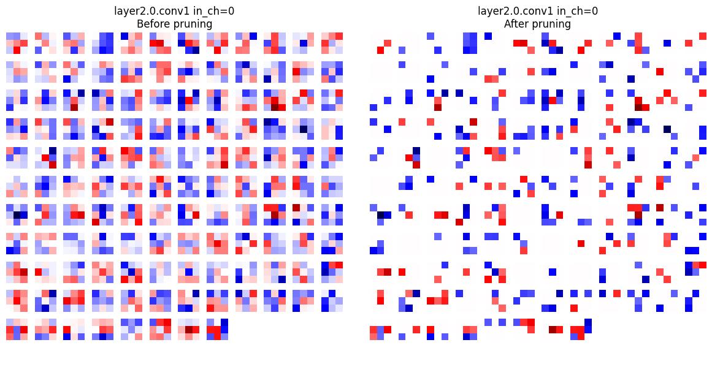
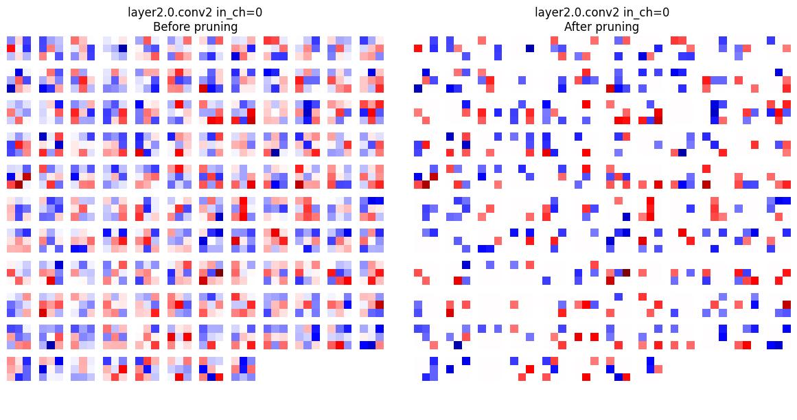
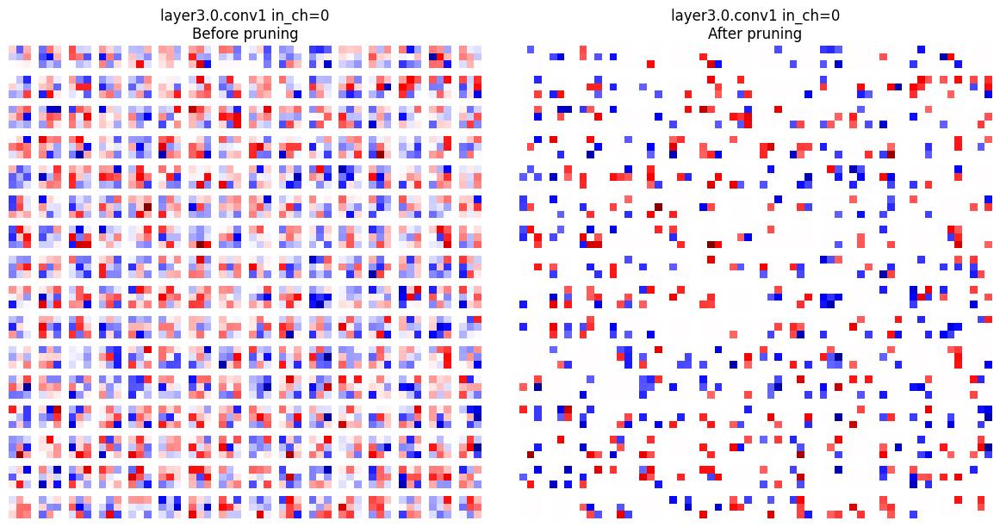
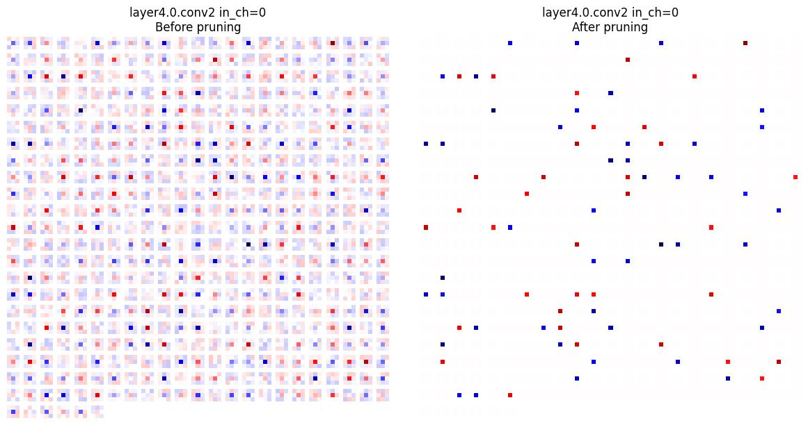
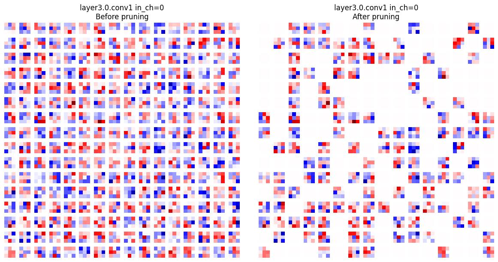

# Pruning Convolutional Neural Networks

_Gilbert François Duivesteijn_

## About

This repository explores how to prune trained networks. For this purpose a very small ResNet10 has been chosen, trained with FashionMNIST.

## Unstructured Pruning (Most Common by Default)

In unstructured pruning, the pruning mechanism operates at the level of individual weight elements within a tensor. For example, PyTorch's default pruning methods such as `prune.global_unstructured` or `prune.l1_unstructured` will set some individual weights to zero, regardless of their location in the weight tensor.

For a convolutional layer (`Conv2d`), whose weights have the shape `(out_channels, in_channels, kernel_height, kernel_width)`, unstructured pruning will zero out selected elements distributed throughout this tensor.

The result of unstructured pruning is that some weights within each output channel (filter) become zero, but it is rare for all weights in a channel to be pruned to zero unless the pruning amount is very aggressive. Most output channels will still have some nonzero weights remaining.

This explains why, in L1-norm per channel plots made after unstructured pruning, the bars representing each output channel's L1-norm are almost always above zero. The L1-norm for a channel is the sum of the absolute values of all its weights; as long as at least one weight remains nonzero, the L1-norm will be positive. Therefore, unstructured pruning does not remove whole channels or filters, but only zeros out some weights within each filter.

## Structured Pruning (Filter/Channel Pruning)

Structured pruning takes a different approach: it can remove entire filters or channels from a layer. For instance, using `prune.ln_structured` with `dim=0` in PyTorch will zero out all weights associated with a specific output channel (filter) in a convolutional layer.

After structured pruning, if you visualize the L1-norm per channel, you may observe some bars dropping exactly to zero. This indicates that the corresponding filter has been entirely zeroed out—effectively, it has been pruned away.

Structured pruning is generally more hardware-efficient than unstructured pruning. Because whole filters or neurons are removed, it is possible to re-architect the model to physically eliminate these pruned components, which can lead to real reductions in memory and computation during inference.

## Experimental results of unstructured pruning

In this experiment, we began by training a custom ResNet-10 architecture on the Fashion-MNIST dataset, allowing the model to learn useful features for classifying grayscale clothing images. After achieving a well-performing baseline, we applied unstructured pruning to the trained network to induce sparsity in the model’s weights. To analyze the effect of pruning, we first visualized the L1-norms of the weights for each layer, which provided insight into the importance and sparsity of individual channels. We also generated activation plots to observe how the responses of different layers changed due to pruning. Furthermore, for a more detailed understanding, we visualized all filters corresponding to input channel 0 for each convolutional layer, both before and after pruning, allowing us to directly observe which parts of the model had significant weights set to zero. After this analysis, we retrained (fine-tuned) the pruned model and compared its test accuracy to that of the original unpruned model, evaluating how well the pruned network could recover its performance.

| ResNet10 | full network | unstructured pruned |structured pruned |
| ------------------------ | --------- | ---------------------------- |---------------------------- |
| batch size               | 64        | 64                           |64                           |
| epochs                   | 15        | 5                            |15                           |
| learning rate            | 1.0e-3    | 10e-4                        |10e-4                        |
| accuracy                 | 0.9265    | 0.9291                       |0.9106                       |
| prune ratio              | n/a       | 0.9                          |0.5                          |
| params                   | 4,904,650 | 4,904,650                    |2,459,338                    |
| Total mult-adds (Mbytes) | 15.25     | 15.25                        |7.94                         |

*Table 1: Before and after pruning of trained ResNet10.* 

   
  <em>Figure 1: Prune ratio against accuracy for structrured pruned networks</em>

|               |
| ------------------------------------------------------- |
|             |
|  |

*Figure 2: L1 Norm per channel per layer for Resnet10 after training (first row), unstructured pruning (second row) and structured pruning (third row).*

|  |  |
| ---------------------------------------- | ---------------------------------------- |
|  |  |
|  |  |
|  |  |

*Figure 3: Weight values (filters) of layer 1, 2, 3 and 4, channel 0 before and after unstructured pruning for Resnet10. Note that in layer 4, more than 90% has been pruned. These layers can be considered for removal.*

|  |  |
| ------------------------------------------- | ------------------------------------------- |
|  |  |
|  |  |
|  |  |

*Figure 4: Weight values (filters) of layer 1, 2, 3 and 4, channel 0 before and after structured pruning for Resnet10. In contrast to the unstructured pruning, some filters are removed, the remaining filters stay unchanged.*
